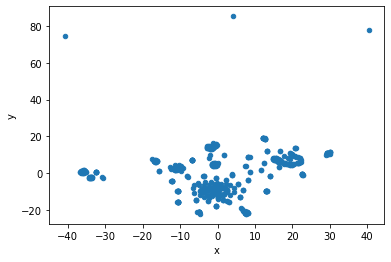
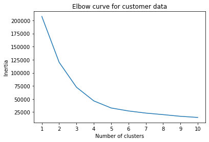
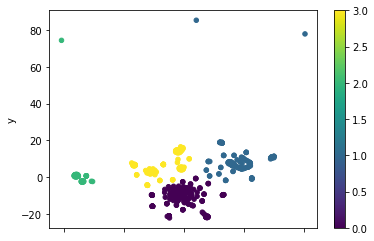

# Cryptocurrency Clusters - Unsupervised Meachine Learning Challenge

This repository contains my solution the GA Tech Data Analytics and Data Science Bootcamp - Unsupervised Machine Learning Challenge

## Key Artifacts
[Unsupervised Machine Learning Cyptocurrency Clusters Jupyter Notebook](cypto_data.ipynb)

## Background

* You are on the Advisory Services Team of a financial consultancy. One of your clients, a prominent investment bank, is interested in offering a new cryptocurrency investment portfolio for its customers. The company, however, is lost in the vast universe of cryptocurrencies. They’ve asked you to create a report that includes what cryptocurrencies are on the trading market and determine whether they can be grouped to create a classification system for this new investment.

* You have been handed raw data, so you will first need to process it to fit the machine learning models. Since there is no known classification system, you will need to use unsupervised learning. You will use several clustering algorithms to explore whether the cryptocurrencies can be grouped together with other similar cryptocurrencies. You will use data visualization to share your findings with the investment bank.

## Instructions

### Data Preparation
The following steps were performed to prepare the data:

* Read `crypto_data.csv` into Pandas. The dataset was obtained from [CryptoCompare](https://min-api.cryptocompare.com/data/all/coinlist).

* Discard all cryptocurrencies that are not being traded. In other words, filter for currencies that are currently being traded. Once you have done this, drop the `IsTrading` column from the dataframe.

* Remove all rows that have at least one null value.

* Filter for cryptocurrencies that have been mined. That is, the total coins mined should be greater than zero.

* In order to make the dataset to be comprehensible to a machine learning algorithm, the data needed to be numeric. Since the coin names do not contribute to the analysis of the data, deleted the `CoinName` and another column `Unnamed: 0` from the original dataframe.

* Your next step in data preparation is to convert the remaining features with text values, `Algorithm` and `ProofType`, into numerical data. This was done using the Pandas `getdummies` function. Examine the number of rows and columns of your dataset now. How did they change? 
  #### Observation 
  After the `getdummies` function was used to convert categorical columns to numbers, the number of columns changed from 4 to 98. 

* Standardized your dataset so that columns that contain larger values do not unduly influence the outcome by scaling the data using the Standard Scaler.

### Dimensionality Reduction

* Creating dummy variables above dramatically increased the number of features in your dataset. Perform dimensionality reduction with PCA. Rather than specify the number of principal components when you instantiate the PCA model, it is possible to state the desired **explained variance**. For example, say that a dataset has 100 features. Using `PCA(n_components=0.99)` creates a model that will preserve approximately 99% of the explained variance, whether that means reducing the dataset to 80 principal components or 3. For this project, preserve 90% of the explained variance in dimensionality reduction. How did the number of the features change?

  #### Observation 
  After applying the PCA Model on the data, the number of columns i.e. features reduced from 98 to 74 (dimensionality reduction) to retain the 90% Explained Variance Ratio. 

* Next, further reduce the dataset dimensions with t-SNE and visually inspect the results. In order to accomplish this task, run t-SNE on the principal components: the output of the PCA transformation. Then create a scatter plot of the t-SNE output. Observe whether there are distinct clusters or not.

  #### Observation 
  After reducing the dataset dimensions with t-SNE and plotting the graph there were some clusters observed per the following graph:
  
  

### Cluster Analysis with k-Means

* Using a for-loop to determine the inertia for each `k` between 1 through 10, an elbow plot was created to identify the best number of clusters.

* It was observed that the  elbow of the plot is where the value of `k = 4`. 

### Recommendation

* Based on the model and the graphical results, it appears that the cryptocurrencies be clustered together into `4` different Clusters? 
* Using that data a new scatter plot was created with the clusters as the class represented by a different color as shown below:

 
